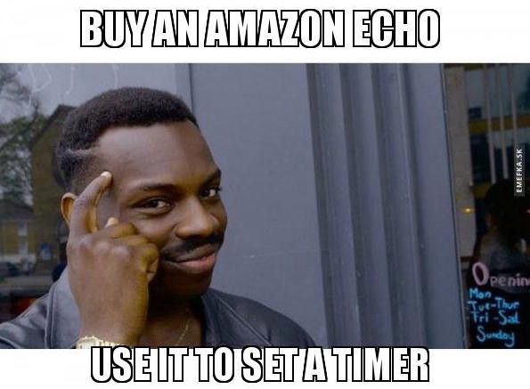
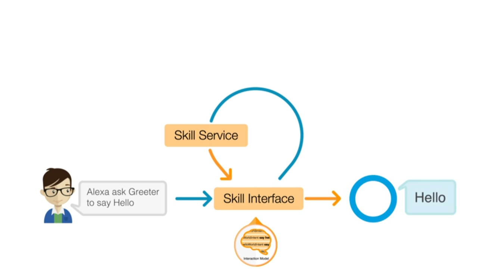
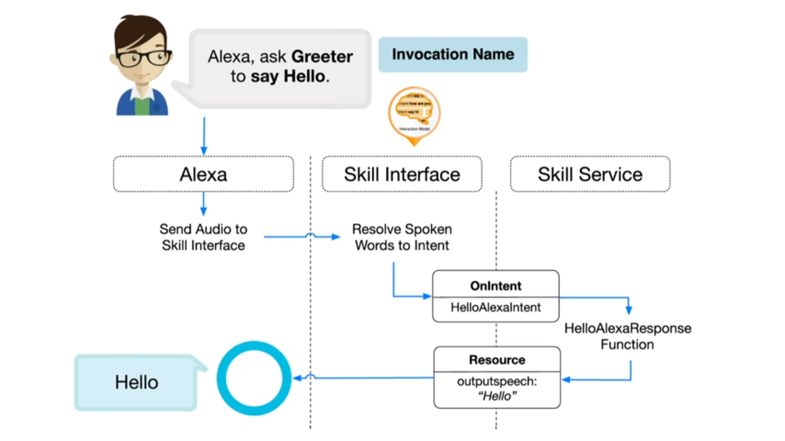

+++
## Building an Alexa app with AWS Lambda

+++

### What is AWS Lambda
"AWS Lambda is an event-driven, serverless computing platform. It runs code in response to events and automatically manages the computing resources required by the code."
+++

### Flow Diagram

+++

### Flow Diagram

+++